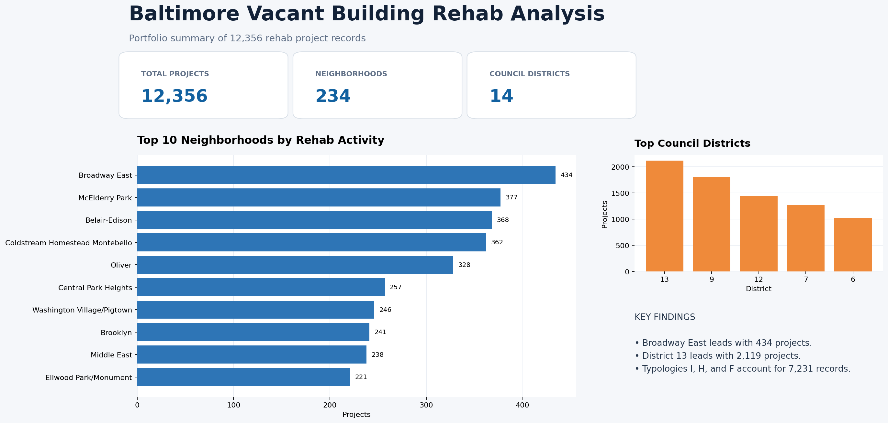

# Baltimore Vacant Building Rehab Analysis

## Project overview

This Excel business-intelligence project analyzes **12,356 vacant-building rehab records** across Baltimore City to identify where rehabilitation activity is concentrated and which areas may need additional planning, outreach, or investment review.

## Business problem

City leaders and community-development stakeholders need a clear view of where vacant-building rehabilitation is occurring, which council districts contain the most activity, and which property-use patterns dominate the records.

## Business questions

- Which neighborhoods contain the most rehab projects?
- Which council districts record the most activity?
- What existing-to-proposed building-use patterns occur most often?
- Which housing-market typologies attract the most recorded activity?

## Methods

- Reviewed and cleaned the Open Baltimore dataset in Excel
- Created PivotTables for neighborhood, council district, use, and market typology
- Ranked categories by project count
- Built KPI cards and charts for an executive dashboard
- Summarized results in an intelligence brief

## Key findings

1. **Broadway East had the most recorded projects:** 434, followed by McElderry Park (377), Belair-Edison (368), and Coldstream Homestead Montebello (362).
2. **Council District 13 led the city:** 2,119 records, ahead of District 9 (1,807) and District 12 (1,446).
3. **Residential use dominates the records.** The most common existing-to-proposed patterns were `1-08 → 1-08` (5,529 records), `SF → SF` (1,479), and `VAC → SF` (977).
4. **Housing-market typologies I, H, and F had the highest counts:** 3,345, 2,200, and 1,686 records, respectively.

## Recommendations

- Prioritize deeper review of Broadway East and District 13 to understand the programs or market conditions driving activity.
- Compare high-activity areas with neighborhoods that have substantial vacancy but fewer recorded rehabs to identify possible service gaps.
- Standardize building-use codes before future analysis so equivalent residential categories are not split across labels such as `SF`, `1-08`, and `Single Family Dwelling`.
- Add time trends and funding data to evaluate whether activity is increasing and which investments produce completed rehabs.

## Limitations

- Counts describe records in the dataset; they do not by themselves measure project cost, completion, quality, or neighborhood impact.
- Building-use codes require a data dictionary for full interpretation.
- The source is updated over time, so results reflect the downloaded workbook used for this analysis.

## Data source

[Vacant Building Rehabs — Baltimore City / Data.gov](https://catalog.data.gov/dataset/vacant-building-rehabs)

## Files

- [`analysis-summary.csv`](data/analysis-summary.csv) — verified portfolio-level results from the workbook
- [`rehab-dashboard-summary.png`](images/rehab-dashboard-summary.png) — portfolio summary image

The full working Excel file contains 12,356 records, PivotTables, the original dashboard, and an intelligence brief. It is not duplicated here because the source data remain available from the official link above.

## Tools

Excel, PivotTables, KPI design, data cleaning, data visualization, business intelligence
